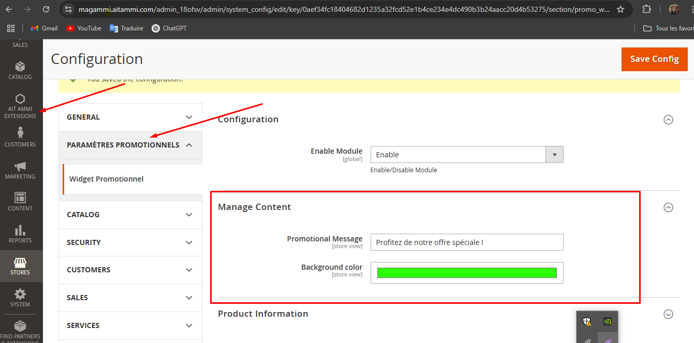
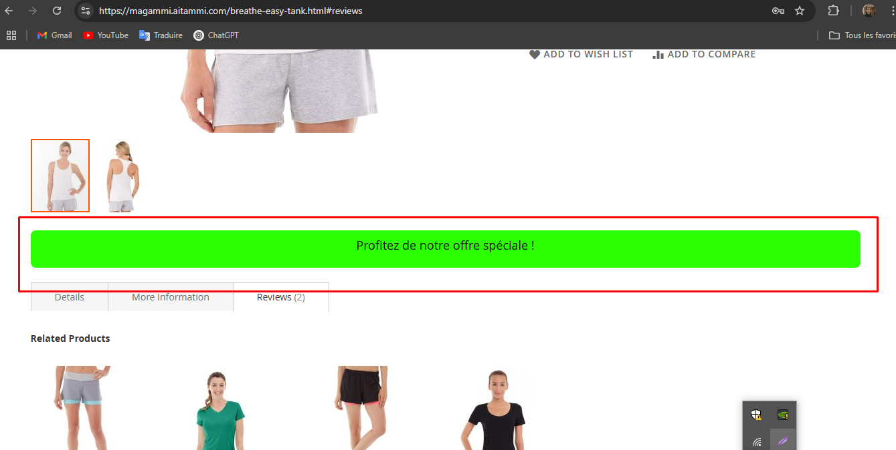
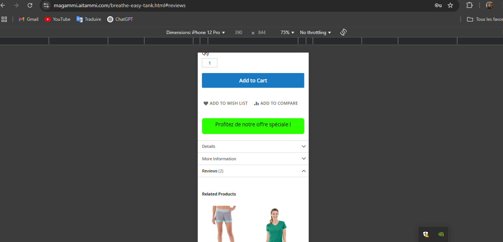

# PromoWidget - Module Magento 2

## Objectif
Ce module permet d'afficher un message promotionnel personnalisé sur les pages produit de Magento 2. Ce message est global à toutes les fiches produits et peut être configuré depuis le back-office Magento. Il peut être personnalisé pour différents sites web.

## Fonctionnalités
- Création d'un widget Magento 2 affichant un message promotionnel personnalisé.
- Intégration de **KnockoutJS** pour lier dynamiquement les données du message promotionnel (texte, couleur de fond) à l'interface utilisateur.
- Stylisation avec **CSS** pour assurer un affichage responsive.
- Utilisation de **RequireJS** pour gérer les dépendances JavaScript.
- Apparition du message promotionnel après un délai de 5 secondes après le chargement de la page.
- Intégration via **layout XML** pour positionner le widget sur la page produit.

## Installation
### 1. Télécharger et déployer le module
- Téléchargez le fichier zip du module ou clonez le dépôt :
  ```bash
  git clone https://github.com/ammirahi/PromoWidget.git
  ```
- Copiez le dossier `Ammi/PromoWidget` dans `app/code/Ammi/PromoWidget`.
- Assurez-vous que Magento détecte bien le module.

### 2. Activer le module
Exécutez les commandes suivantes depuis la racine de votre installation Magento :
```bash
php bin/magento module:enable Ammi_PromoWidget
php bin/magento setup:upgrade
php bin/magento setup:di:compile
php bin/magento cache:flush
```

### 3. Configuration
- Rendez-vous dans le back-office Magento : **Stores > Configuration > PromoWidget**.
- Personnalisez le message promotionnel et ses paramètres (texte, couleur de fond, etc.).
- Activez le widget et enregistrez les modifications.

## Captures d'écran
### Configuration dans le back-office


### Exemple d'affichage du widget


### Exemple d'affichage du widget in mobile


